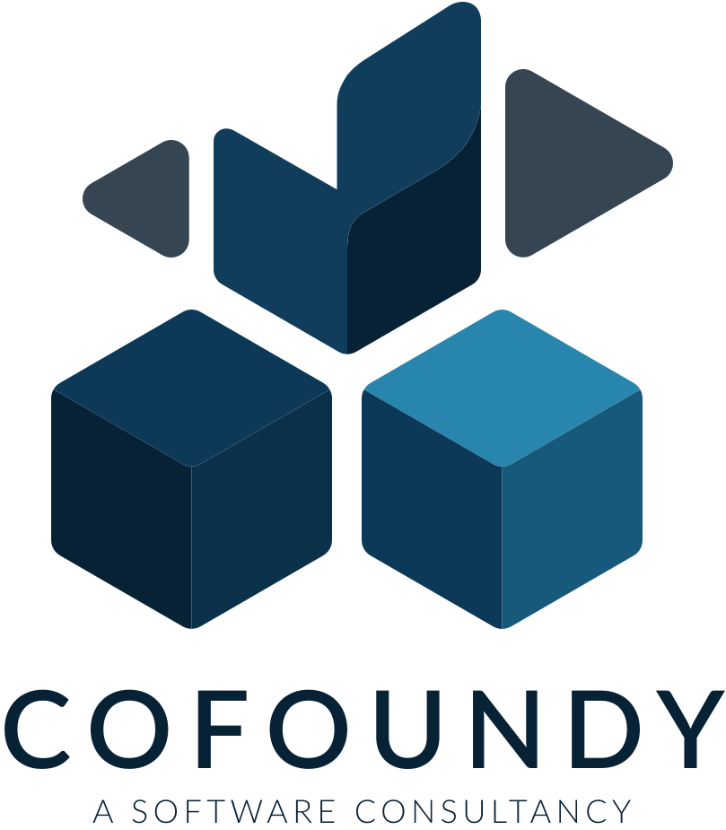

<p align="center">
  <picture>
    <source media="(prefers-color-scheme: dark)" srcset=".github/logo-cofoundy-white.svg" />
    <source media="(prefers-color-scheme: light)" srcset=".github/logo-cofoundy-dark.svg" />
    
  </picture>
</p>

<h1 align="center">Daniel Bonifaz Zegarra — Portafolio</h1>

<p align="center">
  Portafolio personal y hub de marca para <strong>Daniel Bonifaz Zegarra</strong>: CEO de Kambista, autor bestseller, TEDx Speaker y emprendedor serial peruano.
</p>

<p align="center">
  <a href="https://danielbonifaz.com">danielbonifaz.com</a>
</p>

---

## Vista previa

Bento-grid interactivo que presenta el ecosistema completo de Daniel: empresas fundadas (Kambista, Flip, My Good Week), libros publicados, podcast Emprendebroders, charlas TEDx y newsletter Bizz.

### Secciones

| Sección | Contenido |
|---------|-----------|
| **Intro** | Tagline, CTA y scrollytelling del ecosistema |
| **Ecosistema** | Kambista (fintech), Flip (wealthtech), My Good Week (productividad) |
| **Libros** | *La Fórmula para Emprender* y *El Arte de la Distracción* (Ed. Planeta) |
| **Podcast** | Emprendebroders — 4.8 en Spotify |
| **Speaking** | Charlas TEDx y conferencias |
| **Newsletter** | Bizz — +13K suscriptores |
| **Stats** | +500K comunidad, 3 empresas, $1B+ en transacciones |

---

## Tech Stack

| Tecnología | Uso |
|-----------|-----|
| [Astro](https://astro.build) 5 | Framework (static site) |
| [Tailwind CSS](https://tailwindcss.com) 4 | Estilos |
| [Lenis](https://lenis.darkroom.engineering) | Smooth scroll |
| [Sharp](https://sharp.pixelplumbing.com) | Optimización de imágenes |
| TypeScript | Type safety |

---

## Desarrollo local

```bash
# Instalar dependencias
pnpm install

# Servidor de desarrollo (localhost:4321)
pnpm dev

# Build de producción
pnpm build

# Preview del build
pnpm preview
```

---

## Deployment

Desplegado automáticamente en **Cloudflare Pages** con GitHub Actions en cada push a `main`.

| Entorno | URL |
|---------|-----|
| Producción | [portafolio-dbz.pages.dev](https://portafolio-dbz.pages.dev) |
| Custom domain | [danielbonifaz.com](https://danielbonifaz.com) |

---

## Estructura del proyecto

```
src/
├── pages/
│   └── index.astro              # Página principal
├── layouts/
│   └── BaseLayout.astro         # Layout base (SEO, fonts, analytics)
├── components/
│   ├── sections/                # Secciones del bento grid
│   │   ├── IntroCard.astro
│   │   ├── PhotoCard.astro
│   │   ├── EcosystemCard.astro
│   │   ├── BooksCard.astro
│   │   ├── PodcastCard.astro
│   │   ├── SpeakingCard.astro
│   │   ├── NewsletterCard.astro
│   │   ├── StatsGrid.astro
│   │   └── Scrollytelling.astro
│   └── ui/                      # Componentes reutilizables
│       ├── BentoCard.astro
│       ├── Button.astro
│       ├── SectionHeader.astro
│       └── SocialIcon.astro
├── content/                     # Data (JSON)
│   ├── site/                    # Info personal y métricas
│   ├── projects/                # Kambista, Flip, My Good Week
│   ├── books/                   # Libros publicados
│   └── story/                   # Capítulos del scrollytelling
├── assets/images/               # Imágenes optimizadas por Astro
└── styles/
    └── global.css               # Variables CSS y estilos globales
```

---

<p align="center">
  <sub>Hecho con cariño por el equipo de <a href="https://cofoundy.dev"><strong>Cofoundy</strong></a></sub>
  <br/>
  <sub>Productos de software en semanas, no meses.</sub>
</p>
